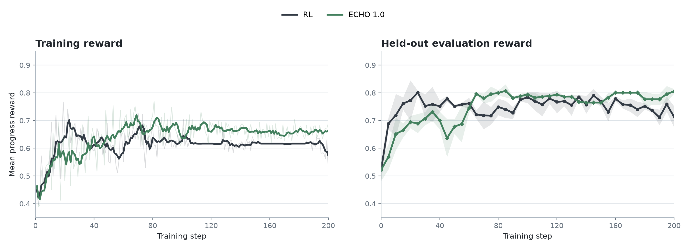
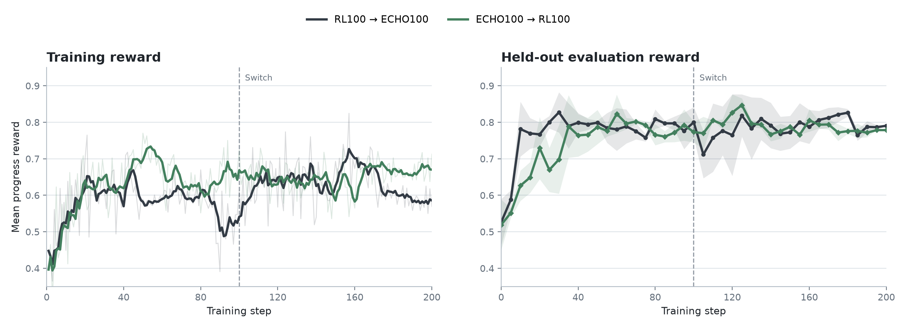
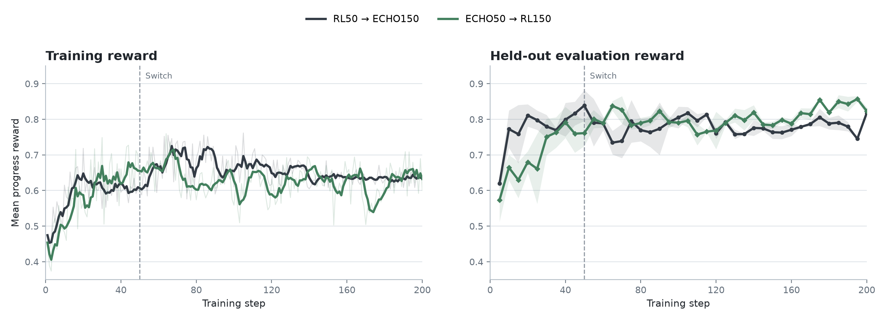
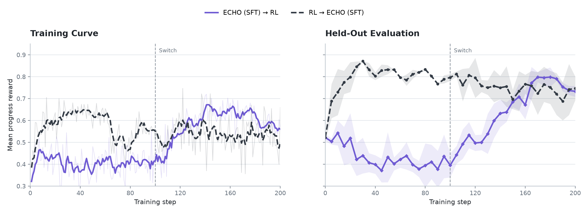
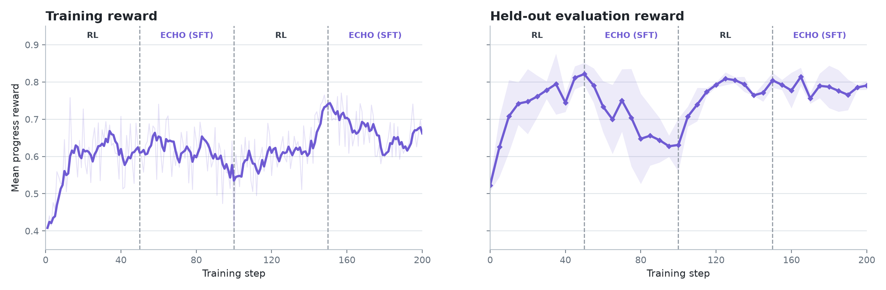

# ECHO on BabyAI


## Introduction

[ECHO](https://arxiv.org/abs/2605.24517) has shown promise in coding-style tasks, where predicting environment feedback or terminal output provides a dense auxiliary signal alongside reinforcement learning. We wanted to test whether the same idea transfers to a more embodied setting: an agent acting in a small world, receiving a new observation after every action, and learning from both reward and the environment.

We study this question on BabyAI using Prime-RL's built-in ECHO algorithm under a strict 20-turn interaction budget. The main experiment compares RL training with three ECHO variants, distinguished by the coefficient applied to the separately normalized observation-prediction loss, across three independent training runs. We also run experiments that change from RL to ECHO, or ECHO to RL. Finally, we isolate the observation-prediction objective by alternating between pure RL and pure ECHO (SFT) during training.

All three ECHO variants finish above RL in mean held-out reward, and stronger ECHO weights substantially reduce the number and length of candidate rollouts required to fill a training batch under the constrained 20 turn limit.

## ECHO objective

RL updates the assistant action tokens using reward derived advantages. ECHO retains that policy objective and adds a next-token prediction loss over environment-observation tokens that arrive after assistant actions. The model sees those observations as context during rollout; the auxiliary loss teaches it to predict them during training.

Conceptually, a trajectory is trained in two complementary ways:

```text
Assistant: move forward          <- RL policy objective
Environment: You see a red ball <- ECHO observation objective
Assistant: pickup red ball 0     <- RL policy objective
Environment: You picked it up    <- ECHO observation objective
```

## Task and setup

We use BabyAI from [AgentBoard](https://github.com/hkust-nlp/AgentBoard), a collection of partially observable grid-world instruction-following tasks. The agent does not receive the full map. At each turn, it receives a text rendering of its egocentric field of view, describing visible objects relative to its current position, nearby walls, and what it is carrying. Objects include colored balls, boxes, keys, and doors; doors may be closed or locked, so information and objects outside the current view must be found through exploration.

The benchmark covers 28 BabyAI subtask families. A subtask family is an environment template with a shared goal structure, generation rules, and difficulty setting; individual tasks within a family are different generated layouts and object placements. For example, every `GoToDoor` task asks the agent to reach a specified door, while each instance can use a different map, door color, and starting state. The families in our dataset are:

| Primary goal | BabyAI subtask families |
| --- | --- |
| Navigate and find | `GoToRedBallGrey`, `GoToRedBall`, `GoToRedBallNoDists`, `GoToObjS6`, `GoToLocalS8N7`, `GoToObjMazeS7`, `GoToImpUnlock`, `GoToSeqS5R2`, `GoToRedBlueBall`, `GoToDoor`, `GoToObjDoor`, `FindObjS7` |
| Open doors | `Open`, `OpenRedDoor`, `OpenDoorLoc`, `OpenRedBlueDoorsDebug`, `OpenDoorsOrderN4Debug` |
| Pick up and manipulate | `Pickup`, `UnblockPickup`, `PickupLoc`, `PickupDistDebug`, `PickupAbove` |
| Unlock and multi-stage | `KeyCorridorS6R3`, `Unlock`, `UnlockLocalDist`, `UnlockPickupDist`, `UnlockToUnlock`, `BlockedUnlockPickup` |

These families include objectives such as navigating to a specified object or door, picking up an object, opening or unlocking doors, completing ordered sequences, and moving obstructions to reach a target. The policy emits short text actions such as `turn left`, `move forward`, `pickup red ball 0`, or `toggle blue door 1`; after each action, the environment returns a new partial text observation. Each family contributes four generated tasks: three are used for training and one is held out for evaluation.


*Examples of three BabyAI levels. Source: Figure 1 from Chevalier-Boisvert et al., ["BabyAI: A Platform to Study the Sample Efficiency of Grounded Language Learning"](https://arxiv.org/abs/1810.08272), ICLR 2019.*

We use 84 training tasks and 28 held-out tasks, preserving the same 3:1 split within each BabyAI subtask family. The main configuration is:

| Setting | Value |
| --- | --- |
| Model | Qwen3.5-9B |
| Training length | 100 policy updates |
| Retained training batch | 128 rollouts |
| Rollouts per task group | 8 |
| Maximum interaction length | 20 turns |
| Sampling temperature | 0.7 |
| Thinking | Disabled |
| Held-out evaluation | 28 tasks × 3 rollout replicates per checkpoint |

The 20-turn cap was limiting. A hard turn cap acts as a coarse length penalty because a policy that needs additional actions cannot continue collecting progress. The reward comparison therefore reflects both task learning and the ability to make progress within a fixed interaction budget. It may favor policies that solve tasks in fewer turns, and RL could match or exceed ECHO if given a larger budget.

This constrained setting is still practically meaningful. Inference costs and fixed agent budgets make length efficiency important. ["True Agents Model the World"](https://www.primeintellect.ai/blog/true-agents-model-the-world) similarly studies ECHO  **Need to go look back at blog to see what was written again**.

We use three related experiments to separate the main questions:

1. **RL versus ECHO:** We compare RL with ECHO weights 0.05, 0.5, and 1.0 to test whether observation prediction changes reward, training consistency, turn usage, and rollout efficiency, and whether those effects depend on its weight. This primary comparison uses three independent training runs per objective.
2. **Extended 200-step schedules:** Using ECHO 1.0, the strongest final configuration in the primary experiment, we extend non-switched RL and ECHO as well as step-50 and step-100 switches to 200 updates. These single-run schedules test whether early gains persist, disappear, or emerge only after additional steps, and whether the objectives can hand off without destroying learned behavior.
3. **Pure ECHO (SFT) phases:** We disable the RL policy objective during ECHO phases, leaving observation-token supervision as the training signal. These single-run ablations test whether observation prediction can support learning on its own and what happens when it alternates with pure RL.

Every evaluation checkpoint covers the 28 held-out tasks with three rollout replicates per task. In the primary comparison, each checkpoint first averages those replicates within a training run; the bold curve then shows the mean across the three independent runs, and its band shows plus or minus one sample standard deviation across runs. All other experiments have one training run per configuration, so their evaluation bands show variation across rollout replicates rather than across independent runs.

## ECHO vs. RL


*Training reward uses a five-step moving mean. Bold lines are means across three independent training runs; faint lines show the individual runs; bands are plus or minus one sample standard deviation across runs.*


Across three independent training runs, all three ECHO variants finish above RL in mean held-out reward. ECHO 0.05 reaches its best mean earliest, at step 60. ECHO 1.0 improves more gradually, reaches the strongest final mean, and has the smallest across-run variation at step 100.

RL also has the largest run-to-run variation at the final checkpoint: its SD is 0.053, compared with 0.036 for ECHO 0.05, 0.035 for ECHO 0.5, and 0.011 for ECHO 1.0. Every tested ECHO weight achieves a higher peak and final mean reward than RL while also producing a more consistent final result across runs.

These findings are promising but scoped. We tested one model size in one embodied AI environment using 84 training tasks and 28 held-out tasks, with three independent training runs per objective. They provide evidence that ECHO handles this length-constrained embodied setting well and motivate replication across turn limits, environments, model families, and dataset sizes.

## Extending the schedules to 200 steps

We next ran six standard ECHO/RL schedules for 200 training steps: `RL200`, `ECHO 1.0 200`, `RL50 → ECHO150`, `ECHO50 → RL150`, `RL100 → ECHO100`, and `ECHO100 → RL100`. Unlike the main 100-step comparison, each schedule has only one training run. Every evaluation checkpoint covers 28 held-out tasks with three rollout replicates per task, so the bands show variation across evaluation replicates, not across independent training runs.



The non-switched runs reach similar peak held-out rewards, but on different timelines. RL reaches `0.801` at step 25, then loses much of that gain and finishes at `0.713`. ECHO 1.0 peaks later, reaching `0.807` at step 85, and holds that performance through the end of training with a final reward of `0.805`.



Both step-100 schedules remain viable after changing objectives. `RL100 → ECHO100` peaks at `0.827` at step 30, before the switch, and finishes at `0.790`. `ECHO100 → RL100` peaks at `0.847` at step 125, after the switch, and finishes at `0.779`.



The step-50 schedules finish close together. `ECHO50 → RL150` peaks at `0.857` at step 195 and finishes at `0.823`, while `RL50 → ECHO150` peaks at `0.839` at the step 50 and finishes at `0.818`.

## Pure ECHO (SFT) objective switching

Standard ECHO retains the RL policy objective while adding observation-token prediction. We also tested an ECHO (SFT) phase, the RL reward policy is removed, leaving only supervised next-token prediction over environment observations. These are single training runs, and each evaluation checkpoint reports the mean and standard deviation across three rollout replicates over 28 held-out tasks.




The direction of the effect is clear in both schedules. Under ECHO (SFT) alone, held-out reward falls during the first 100 steps; switching to RL then recovers it. `ECHO (SFT) → RL` falls from `0.522` at initialization to `0.395` at the switch, then reaches a post-switch peak of `0.798` and finishes at `0.733`. In the reverse direction, RL first raises held-out reward to `0.796` at the switch, while the subsequent ECHO (SFT) phase gradually gives back part of that gain and finishes at `0.746`. Pure observation prediction therefore does not replace RL in this setting, although the model remains recoverable when RL is restored.

We also alternated the objectives every 50 steps:




The first ECHO (SFT) phase reduces held-out reward from `0.821` at step 50 to `0.631` at step 100. RL then recovers it to `0.804` at step 150, and the final ECHO (SFT) phase finishes at `0.790`. 

## Turn constraint and rollout efficiency

The turn metrics below describe trainable rollouts: the trajectories that were ultimately used for policy updates.


*Lines show five-step moving means over retained trainable rollouts. Bands are plus or minus one sample standard deviation across three independent runs.*

RL-only trajectories average 18.56 turns, and 83.4% reach the 20-turn limit. Both measurements fall as ECHO weight increases. At ECHO 1.0, trajectories average 17.17 turns and reach the limit 70.7% of the time. All objectives produce longer trajectories later in training, but ECHO delays the shift toward the turn limit.

This is both a result and the central confounder. The cap is binding much more often for RL, so the reward curves partly measure whether a policy can complete or advance a task within 20 actions. They do not tell us how the same policies would rank if RL were allowed to continue acting. RL may be equally strong or stronger at a larger turn budget.

Viewed another way, the hard cap is a form of length penalty: it assigns no value to progress that would occur after turn 20. It is a coarse penalty, but coping with it is useful because real agents operate under latency and inference-compute constraints. The defensible conclusion from these runs is therefore that ECHO copes better with this particular length constraint, not that ECHO unconditionally dominates RL on BabyAI.

Prime-RL generates candidate rollouts until enough trainable samples remain for an update. The next plot shows the percentage of generated candidates that were retained and used for training.


*Lines show the five-step moving mean of retained trainable rollouts divided by generated candidates. Bands are plus or minus one sample standard deviation across three independent runs.*

The usable-sample rate increases monotonically with ECHO weight. Across all 100 steps, it rises from 15.4% ± 1.3% for RL-only to 25.9% ± 2.2% for ECHO 1.0. Correspondingly, the number of extra candidates generated per update falls from 708.9 ± 73.6 to 368.9 ± 43.8. This efficiency result is also conditional on the turn cap: policies that fail to produce useful reward variation within 20 turns are more likely to yield unusable groups.

Three pre-batch filters were active: zero advantage, repetition, and gibberish. The logs record only aggregate generated and retained counts, so we cannot attribute rejected rollouts to individual filters. Qualitative inspection found no obvious repetition or gibberish in the saved trajectories, making zero advantage the likely dominant source of filtering. However, this is an inference rather than a directly measured result.

## What we learned

1. **Under a 20-turn constraint, ECHO improves mean held-out reward.** All tested weights finish above RL across three independent runs, with ECHO 1.0 producing the strongest final result.
2. **ECHO copes better with the hard length penalty.** Higher ECHO weights consistently reduce turn usage, reach the turn limit less often, increase the retained rollout fraction, and reduce the number of generated candidates required per update.
3. **RL and ECHO can hand off without an obvious persistent collapse.** The single 200-step schedules remain viable after switching at step 50 or 100, but they do not establish a generally better ordering or switch point.
4. **The unconstrained comparison remains open.** Because RL reaches the turn cap substantially more often, these experiments cannot determine whether ECHO would retain its advantage with a larger interaction budget.


## Reproducibility artifacts

The BabyAI environment can be found on Prime's Environment Hub.

***CAN INCLUDE THIS WE DON'T HAVE TOO***
The public Hugging Face archives contain adapters, full trainer checkpoints, orchestrator progress, configs, logs, raw training trajectories, and checkpoint evaluations:

- [Independent run 1 results and evaluations](https://huggingface.co/datasets/bhoy/agentboard-babyai-v1-v071-always-on-switch50)
- [Independent run 1 full checkpoints](https://huggingface.co/datasets/bhoy/agentboard-babyai-v1-v071-four-run-checkpoints)
- [Independent runs 2 and 3](https://huggingface.co/datasets/bhoy/agentboard-babyai-v1-v071-independent-runs-2-3)

## Acknowledgments

This work was completed during the Prime-RL residency. Sebastian Müller ([@omouamoua](https://x.com/omouamoua?lang=en)) advised the project, contributed greatly to the design and framing of the study, and helped with the writing. Billy Hoy initiated the project and led the experimentation, writing, and analysis.

## Citation

```bibtex
@article{hoy2026echo,
  title   = "ECHO on BabyAI",
  author  = "Hoy, Billy and Müller, Sebastian",
  year    = "2026",
  month   = "August",
  url     = "https://bhoy1.github.io/echo-babyai-findings/"
}
```
