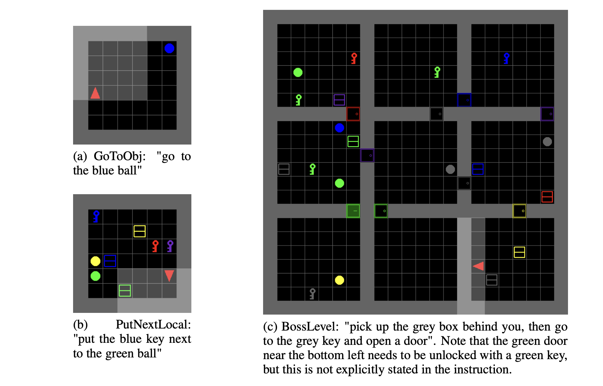
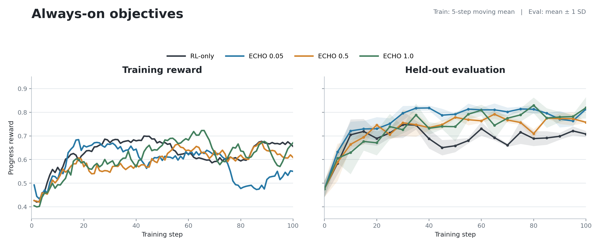
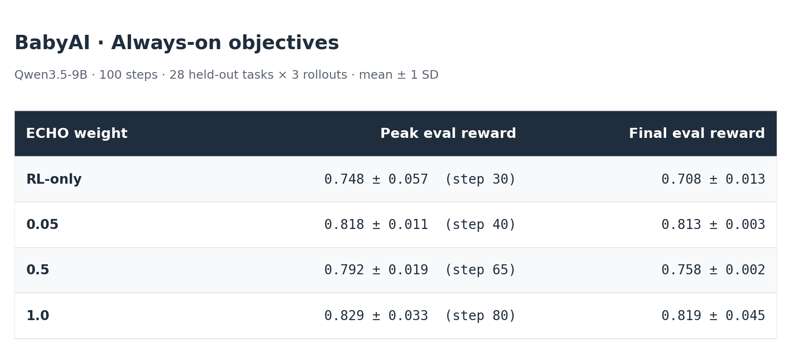
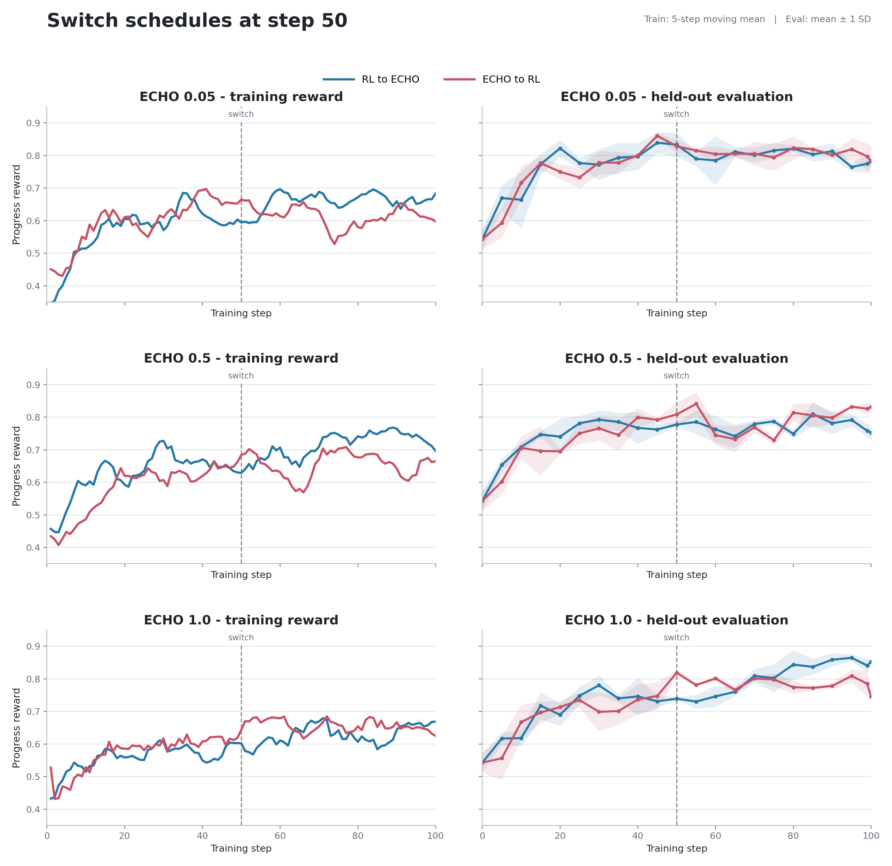
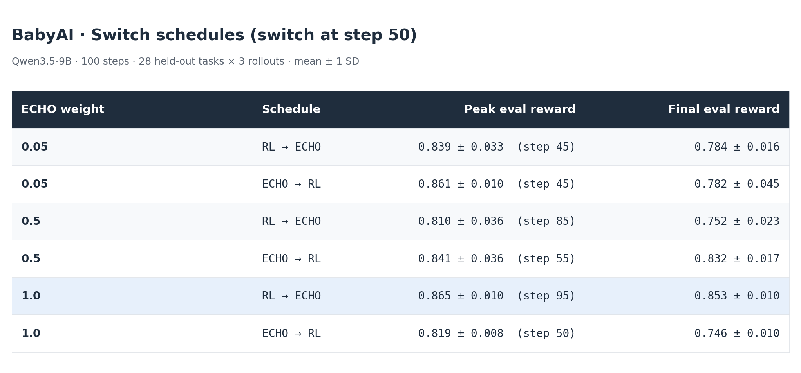
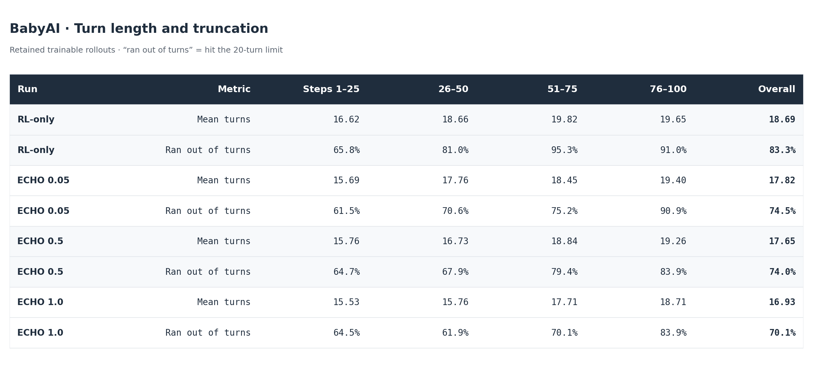
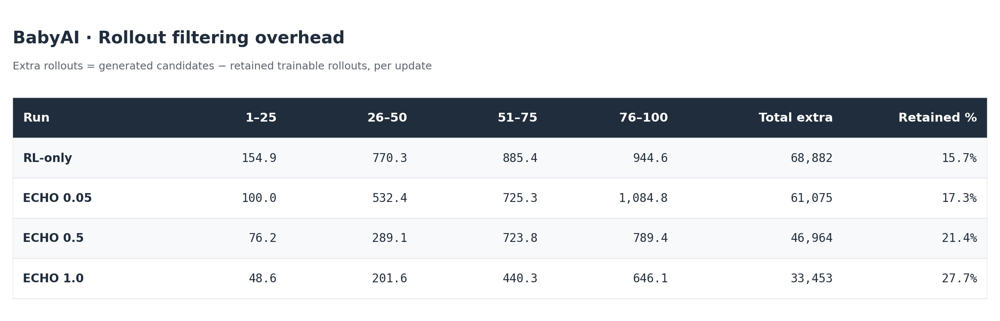

> **Working draft:** The analysis and figure presentation are still being revised.

# ECHO on BabyAI: Updated Findings

Date: 2026-08-09

## Introduction

ECHO has already shown promise in coding-style tasks, where predicting environment feedback or terminal outputs can provide a useful auxiliary signal alongside policy optimization. We wanted to test whether the same idea transfers to more "world model" style tasks, where the model interacts with embodied-AI environments and receives structured observations after each action. This work used Prime-RL, which added ECHO as a built-in algorithm in July 2026 (["prime-rl gets an Algorithms layer"](https://www.primeintellect.ai/blog/algorithms-layer)).

## Task Selection and Experiments

We scoped the task to BabyAI from [AgentBoard](https://github.com/hkust-nlp/AgentBoard): grid-world instruction-following tasks where the agent receives observations and must complete navigation/object-manipulation goals.

*Examples of three BabyAI levels. Source: Figure 1 from Chevalier-Boisvert et al., ["BabyAI: A Platform to Study the Sample Efficiency of Grounded Language Learning"](https://arxiv.org/abs/1810.08272), ICLR 2019.*

We ran Qwen3.5-9B for 100 training steps and evaluated each checkpoint on 28 held-out tasks with three rollout replicates. Reported uncertainty is the mean plus or minus one standard deviation across the three replicate means.

- **Four always-on objectives:** RL-only, and ECHO at weight 0.05, 0.5, and 1.0, each run start-to-finish under a single objective.
- **Six switch schedules:** ECHO weight 0.05, 0.5, and 1.0, each run both as RL → ECHO and ECHO → RL, switching objectives at step 50.

## Always-on objectives

All three ECHO weights beat RL-only on both peak and final eval reward, and RL-only is also visibly the noisiest and least monotone of the four on held-out eval. ECHO 0.05 is the most stable of the three ECHO weights, with SD roughly an order of magnitude tighter than the others at both peak and final. ECHO 1.0 reaches the highest final reward but with much wider variance (± 0.045).

The training-reward panel tells a slightly different story: RL-only actually tracks competitively with the ECHO runs through step 80, and ECHO 0.05's train reward drops sharply after step 80 even though its eval reward stays flat. That train/eval decoupling at low lambda is worth investigating further, including whether it reflects overfitting or a shift in the task composition of the training updates.

## Switch schedules (phase runs, switch at step 50)

RL → ECHO at λ = 1.0 is the best run in the full sweep on both peak and final eval reward, and it has the tightest variance of any switch run (± 0.010 on both). It clears every always-on variant on final reward (0.853 vs. 0.819 for the best always-on run).

Which order wins depends on λ, and it isn't consistent:
- At λ = 0.05, the two orders are essentially tied on final reward (0.784 vs. 0.782); ECHO → RL peaks slightly higher at the same step but decays more afterward.
- At λ = 0.5, ECHO → RL wins clearly on final reward (0.832 vs. 0.752).
- At λ = 1.0, RL → ECHO wins clearly on final reward (0.853 vs. 0.746) — the opposite direction from λ = 0.5.

The eval curves make the λ = 1.0 case the most visually distinct: RL → ECHO climbs through the second half of training and finishes near 0.85, while ECHO → RL plateaus and drifts down toward 0.74–0.78 after the switch. At λ = 0.05 and 0.5 the two orders track each other closely through the switch point and only separate modestly afterward.

### Working interpretation

The switch experiments were designed to test whether ECHO and RL interfere with one another and whether their ordering matters. When combined with RL, ECHO adds a dense auxiliary training signal over environment-observation tokens, while the RL objective updates the policy using reward-derived advantages. Switching objectives therefore lets us ask whether observation prediction helps develop useful representations before RL, whether it provides a useful complementary signal after RL, and whether changing objectives disrupts behavior learned during the first phase.

Combining ECHO with RL at the appropriate stage could help overcome optimization plateaus, accelerate learning, or reach better final performance. These experiments provide initial evidence about objective compatibility and ordering, while the rollout-efficiency results below suggest a separate potential benefit.

## Turn and rollout-efficiency findings

RL-only hit the turn limit on nearly every training rollout by the second half of training (95.3% at steps 51–75). ECHO delayed this most strongly at weight 1.0, whose overall rate was roughly 13 percentage points lower than RL-only, though all four runs trend toward longer, more turn-limited trajectories as training progresses.

### Rollout filtering overhead

"Extra rollouts" below is `generated candidates - trainable rollouts`: the total volume filtered out before each update. The three enforced pre-batch filters were zero advantage, gibberish, and repetition. Gibberish and repetition filtering are intended to guard against model collapse, and we saw no visible signs of collapse in the saved trajectories. However, the logs report only aggregate generated and trainable counts, not rejection counts for each filter.

Filtering overhead falls monotonically with ECHO weight: RL-only generated 7,807 more filtered rollouts than ECHO 0.05 over the full 100 steps, 21,918 more than ECHO 0.5, and 35,429 more than ECHO 1.0. The retained fraction nearly doubles from RL-only (15.7%) to ECHO 1.0 (27.7%).

### Working interpretation

RL-only's higher rollout cost comes from generating more candidates per update, and its training rollouts are longer and more likely to hit the turn limit. Higher ECHO weight is associated with both a larger trainable fraction and fewer turn-limited episodes. Together, these associations suggest a potential compute-efficiency advantage for ECHO on BabyAI.
