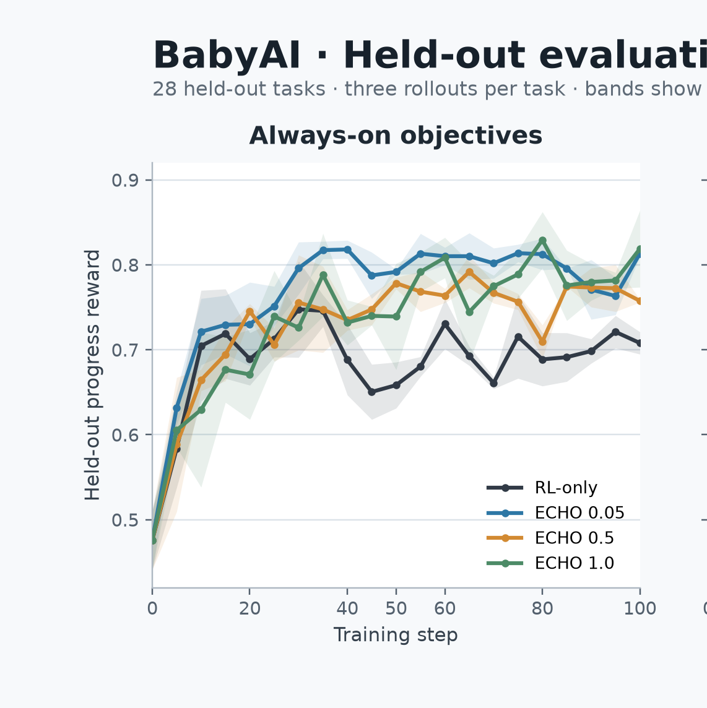
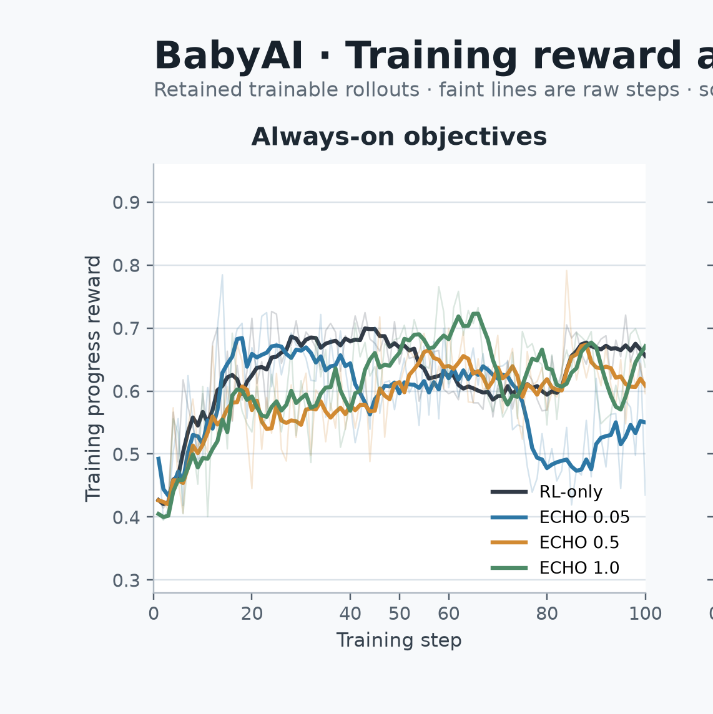
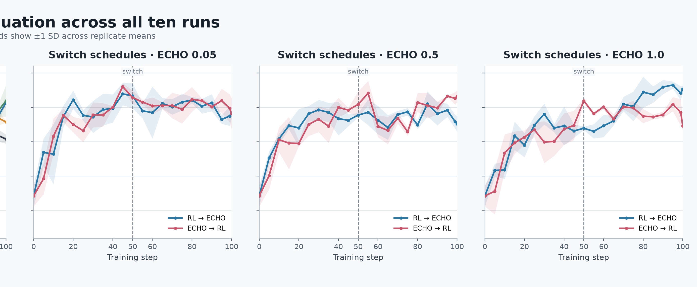
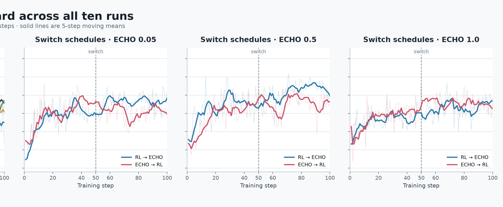

> **Working draft:** The analysis and figure presentation are still being revised.

# ECHO on BabyAI: Updated Findings

Date: 2026-08-09

## Introduction

ECHO has already shown promise in coding-style tasks, where predicting environment feedback or terminal outputs can provide a useful auxiliary signal alongside policy optimization. We wanted to test whether the same idea transfers to more "world model" style tasks, where the model interacts with text-game or embodied-AI environments and receives structured observations after each action. This was built on top of prime-rl, and the same plumbing is expected to be fully supported upstream soon.

## Task Selection and Experiments

We scoped this round to BabyAI from AgentBoard (https://github.com/hkust-nlp/AgentBoard): grid-world instruction-following tasks where the agent receives observations and must complete navigation/object-manipulation goals. As before, we normalized the RL and ECHO loss components independently before applying the ECHO coefficient, since BabyAI trajectories are dominated by observation tokens relative to the short action commands, and without independent normalization the ECHO term can dominate purely by token count.

This round is a full 10-run sweep on Qwen3.5-9B, 100 training steps, evaluated on 28 held-out tasks with 3 rollouts per checkpoint (values reported as mean ± 1 SD across the three rollout-replicate means):

- **Four always-on objectives:** RL-only, and ECHO at weight 0.05, 0.5, and 1.0, each run start-to-finish under a single objective.
- **Six switch schedules:** ECHO weight 0.05, 0.5, and 1.0, each run both as RL → ECHO and ECHO → RL, switching objectives at step 50.

Note: always-on and switch runs were executed at different times and, in some cases, on different GPU nodes, so the pre-switch segments are a within-schedule reference point rather than a controlled comparison against the always-on runs.

## Always-on objectives

All three ECHO weights beat RL-only on both peak and final eval reward, and RL-only is also visibly the noisiest and least monotone of the four on held-out eval. ECHO 0.05 is the most stable of the three ECHO weights, with SD roughly an order of magnitude tighter than the others at both peak and final. ECHO 1.0 reaches the highest final reward but with much wider variance (± 0.045).

The training-reward panel tells a slightly different story: RL-only actually tracks competitively with the ECHO runs through step 80, and ECHO 0.05's train reward drops sharply after step 80 even though its eval reward stays flat. That train/eval decoupling at low lambda is worth digging into further, e.g. whether it's overfitting within the retained-trainable rollout pool or a shift in which tasks stay "trainable" at that weight.

## Switch schedules (phase runs, switch at step 50)

RL → ECHO at λ = 1.0 is the best run in the full sweep on both peak and final eval reward, and it has the tightest variance of any switch run (± 0.010 on both). It clears every always-on variant on final reward (0.853 vs. 0.819 for the best always-on run).

Which order wins depends on λ, and it isn't consistent:
- At λ = 0.05, the two orders are essentially tied on final reward (0.784 vs. 0.782); ECHO → RL peaks slightly higher at the same step but decays more afterward.
- At λ = 0.5, ECHO → RL wins clearly on final reward (0.832 vs. 0.752).
- At λ = 1.0, RL → ECHO wins clearly on final reward (0.853 vs. 0.746) — the opposite direction from λ = 0.5.

The eval curves make the λ = 1.0 case the most visually distinct: RL → ECHO climbs through the second half of training and finishes near 0.85, while ECHO → RL plateaus and drifts down toward 0.74–0.78 after the switch. At λ = 0.05 and 0.5 the two orders track each other closely through the switch point and only separate modestly afterward.

## Turn and rollout-efficiency findings

### Source

Recomputed locally from the ten `training_history.log` files in the public Hugging Face dataset [bhoy/agentboard-babyai-v1-v071-always-on-switch50](https://huggingface.co/datasets/bhoy/agentboard-babyai-v1-v071-always-on-switch50). Local copies live in `training_history_hf/`; this analysis no longer depends on the rental GPU node.

All figures below describe the **retained trainable rollouts** (the subset that survives filtering and is actually trained on), not all generated candidates. See `babyai_final_100_step_training_summary.md` for the weighted comparison between the two populations.

### Turn length and truncation

Prime-RL logs a `Truncation` flag when a rollout hits the 20-turn limit; we refer to this below as **ran out of turns**.

RL-only hit the turn limit on nearly every retained rollout by the second half of training (95.3% at steps 51–75). ECHO delayed this — most at weight 1.0, which stays roughly 13 points below RL-only overall — though all four runs trend toward longer, more turn-limited trajectories as training progresses.

### Rollout filtering overhead

"Extra rollouts" below is `generated candidates − retained trainable rollouts`: the total volume filtered out before each update. This is a measure of overall filtering cost, not a breakdown by filter reason.

Filtering overhead falls monotonically with ECHO weight: RL-only generated 7,807 more filtered rollouts than ECHO 0.05 over the full 100 steps, 21,918 more than ECHO 0.5, and 35,429 more than ECHO 1.0. The retained fraction nearly doubles from RL-only (15.7%) to ECHO 1.0 (27.7%).

### Working interpretation

RL-only's higher rollout cost comes from generating more candidates per update, and the candidates it does retain are longer and more likely to hit the turn limit. Higher ECHO weight is associated with both a larger retained fraction and fewer turn-limited episodes within that retained set — a compute-efficiency effect, distinct from the reward and held-out eval results reported above.

## Files

Underlying CSVs for re-plotting:
- [`training_behavior_metrics.csv`](data/training_behavior_metrics.csv) — per-step training behavior metrics (reward, turns, invalid actions, token counts, etc.), split by `all_candidates` vs `retained_trainable` population, per run.
- [`checkpoint_eval_metrics.csv`](data/checkpoint_eval_metrics.csv) — always-on checkpoint eval metrics (reward/success mean, SD, per-replicate values) for `rlonly`, `echo005`, `echo050`, `echo100`.
- [`babyai_switch50_eval_curve.csv`](data/babyai_switch50_eval_curve.csv) — switch-schedule eval curve (mean reward, replicate SD, per-replicate values) for `base` plus the six switch-50 variants.
