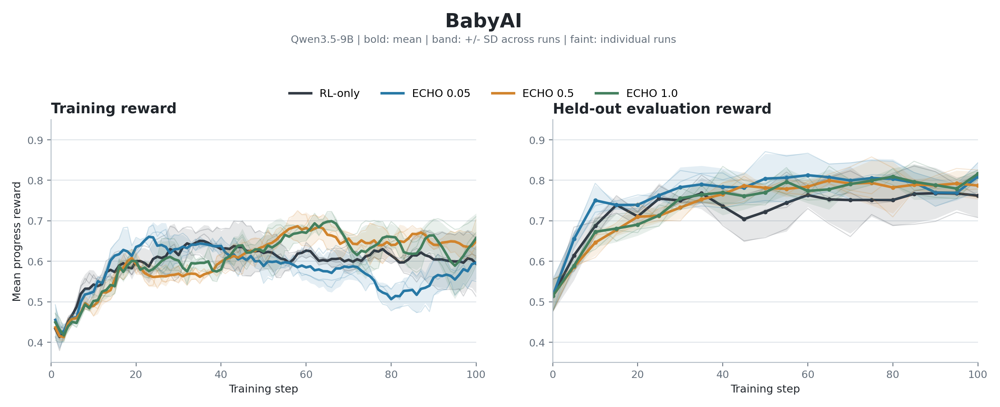
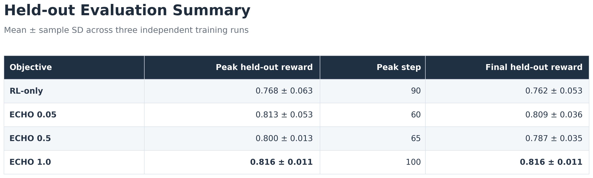
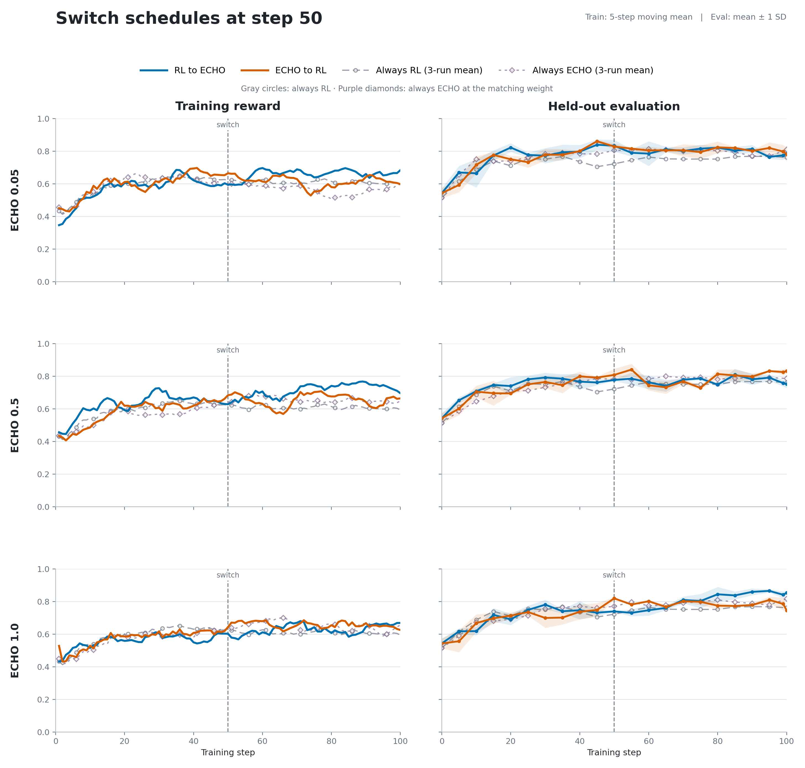
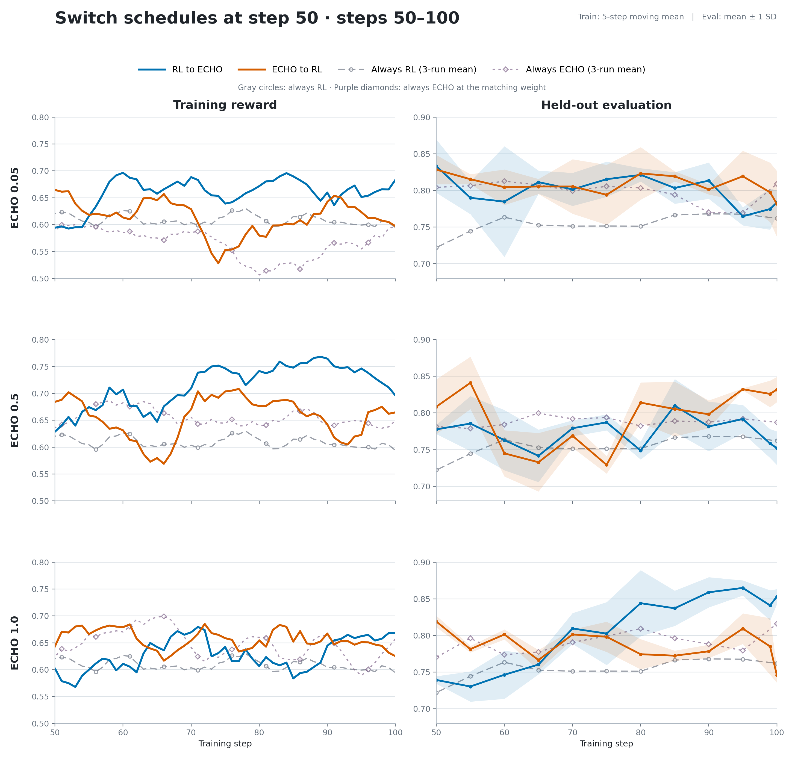
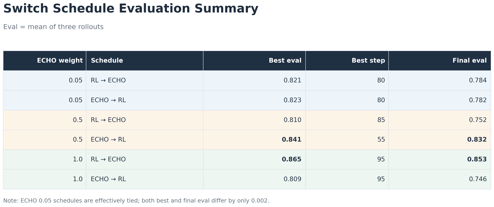
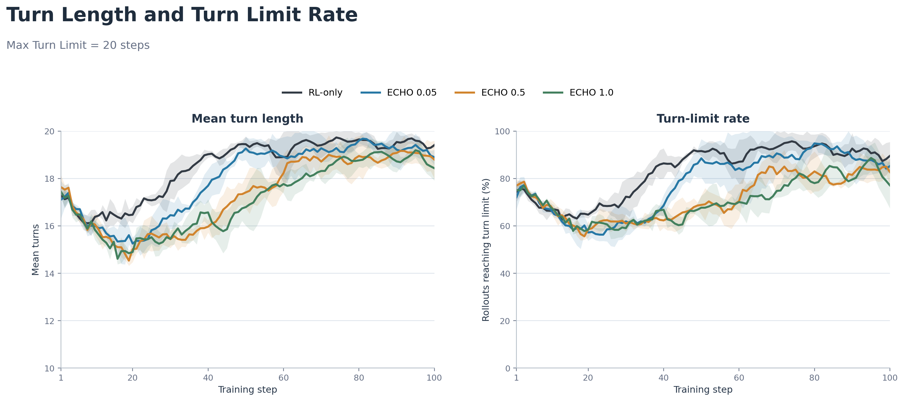
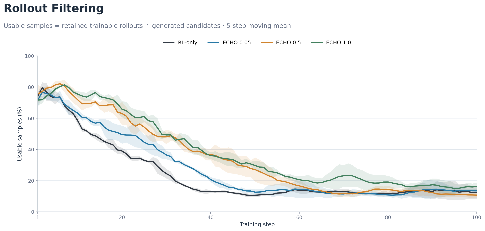

# ECHO on BabyAI


## Introduction

[ECHO](https://arxiv.org/abs/2605.24517) has shown promise in coding-style tasks, where predicting environment feedback or terminal output provides a dense auxiliary signal alongside reinforcement learning. We wanted to test whether the same idea transfers to a more embodied setting: an agent acting in a small world, receiving a new observation after every action, and learning from both reward and the environment.

We study this question on BabyAI using Prime-RL's built-in ECHO algorithm. The main experiment compares RL against three different ECHO weights across three independent 100-step training runs. We also run experiments that change from RL to ECHO, or ECHO to RL, at step 50.

All three ECHO variants finish above RL-only in mean held-out reward, and stronger ECHO weights substantially reduce the number and length of candidate rollouts required to fill a training batch.

## Task and setup

We use BabyAI from [AgentBoard](https://github.com/hkust-nlp/AgentBoard), a collection of grid-world instruction-following tasks involving navigation and object manipulation. The policy emits short text actions such as `turn left`, `move forward`, `pickup red ball 0`, or `toggle blue door 1`; the environment returns a text observation after each action.


*Examples of three BabyAI levels. Source: Figure 1 from Chevalier-Boisvert et al., ["BabyAI: A Platform to Study the Sample Efficiency of Grounded Language Learning"](https://arxiv.org/abs/1810.08272), ICLR 2019.*

We use 84 training tasks and 28 held-out tasks, preserving the same 3:1 split within each BabyAI subtask family. The main configuration is:

| Setting | Value |
| --- | --- |
| Model | Qwen3.5-9B |
| Training length | 100 policy updates |
| Retained training batch | 128 rollouts |
| Rollouts per task group | 8 |
| Maximum interaction length | 20 turns |
| Sampling temperature | 0.7 |
| Thinking | Disabled |
| Held-out evaluation | 28 tasks × 3 rollout replicates per checkpoint |

We ran three independent training runs for each objective: RL-only, ECHO 0.05, ECHO 0.5, and ECHO 1.0. Each plotted checkpoint reward first averages the three evaluation replicates for that training run. The bold curve then reports the mean across the three independent training runs, and the band shows plus or minus one sample standard deviation across those runs.

The switch schedules are different: each direction and ECHO weight currently has one training run. Their evaluation bands therefore show variation across the three evaluation replicates, not variation across independent training runs.

## ECHO objective

RL updates the assistant action tokens using reward-derived advantages. ECHO retains that policy objective and adds a next-token prediction loss over environment-observation tokens that arrive after assistant actions. The model sees those observations as context during rollout; the auxiliary loss teaches it to predict them during training.

Conceptually, a trajectory is trained in two complementary ways:

```text
Assistant: move forward          <- RL policy objective
Environment: You see a red ball <- ECHO observation objective
Assistant: pickup red ball 0     <- RL policy objective
Environment: You picked it up    <- ECHO observation objective
```

## ECHO vs. RL



*Training reward uses a five-step moving mean. Bold lines are means across three independent training runs; faint lines show the individual runs; bands are plus or minus one sample standard deviation across runs.*



Across three independent training runs, all three ECHO variants finish above RL-only in mean held-out reward. ECHO 0.05 reaches its best mean earliest, at step 60. ECHO 1.0 improves more gradually, reaches the strongest final mean, and has the smallest across-run variation at step 100.

RL-only also has the largest run-to-run variation at the final checkpoint: its SD is 0.053, compared with 0.036 for ECHO 0.05, 0.035 for ECHO 0.5, and 0.011 for ECHO 1.0. In this BabyAI experiment, every tested ECHO weight achieves a higher peak and final mean reward than RL-only while also producing a more consistent final result across runs.

These findings are promising but scoped. We tested one model size in one embodied AI environment using 84 training tasks and 28 held-out tasks, with three independent training runs per objective. The results do not establish that ECHO improves embodied AI generally. Instead, they provide initial evidence that ECHO merits study beyond coding tasks and motivate replication across more environments, model families, and dataset sizes.

## Objective switching at step 50

The switch experiments test whether RL and ECHO can hand off to one another without interfering with previously learned behavior, and whether one objective is more useful early or late in training. Each schedule starts from scratch and switches objective at step 50. Because these are separate stochastic runs, their first 50 steps are not expected to match the three-run always-on references exactly.



*Complete 100-step runs. Blue is RL → ECHO, orange is ECHO → RL, gray circles show the always-RL three-run mean, and purple diamonds show the always-ECHO three-run mean at the matching weight.*



*Post-switch steps 50–100 using tighter reward axes. Colored evaluation bands are plus or minus one SD across three evaluation replicates within the single switch run.*



The effect of objective order changes with ECHO weight. At 0.05, the schedules are effectively tied: their best post-switch evaluations are 0.821 and 0.823, and they finish at 0.784 and 0.782. At 0.5, ECHO → RL is much stronger. At 1.0, the result reverses: RL → ECHO reaches 0.865 at step 95 and finishes at 0.853, while ECHO → RL peaks at 0.809 after the switch and finishes at 0.746.

These results show that switching between RL and ECHO is feasible, but they do not establish a generally better ordering or switch point. Five of the six schedules reach a post-switch peak above both matching non-switched references, but only two finish above both references at the final checkpoint. This suggests that combining the objectives at different phases of training may be useful, while also showing that the gains are not consistently maintained. However, each switch schedule was run only once and only on BabyAI. Replicated experiments across multiple switch points and benchmarks are needed to distinguish a genuine scheduling effect from ordinary training-run variation and determine whether the preferred schedule depends on the environment.

## Turn length and rollout efficiency

The turn metrics below describe retained trainable rollouts: the trajectories that were ultimately used for policy updates.



*Lines show five-step moving means over retained trainable rollouts. Bands are plus or minus one sample standard deviation across three independent runs.*

RL-only trajectories average 18.56 turns, and 83.4% reach the 20-turn limit. Both measurements fall as ECHO weight increases. At ECHO 1.0, trajectories average 17.17 turns and reach the limit 70.7% of the time. All objectives produce longer trajectories later in training, but ECHO delays the shift toward the turn limit.

Prime-RL generates candidate rollouts until enough trainable samples remain for an update. The next plot shows the percentage of generated candidates that were retained and used for training.



*Lines show the five-step moving mean of retained trainable rollouts divided by generated candidates. Bands are plus or minus one sample standard deviation across three independent runs.*

The usable-sample rate increases monotonically with ECHO weight. Across all 100 steps, it rises from 15.4% ± 1.3% for RL-only to 25.9% ± 2.2% for ECHO 1.0. Correspondingly, the number of extra candidates generated per update falls from 708.9 ± 73.6 to 368.9 ± 43.8.

Three pre-batch filters were active: zero advantage, repetition, and gibberish. The logs record only aggregate generated and retained counts, so we cannot attribute rejected rollouts to individual filters. Qualitative inspection found no obvious repetition or gibberish in the saved trajectories, making zero advantage the likely dominant source of filtering. However, this is an inference rather than a directly measured result.

## What we learned

1. **Always-on ECHO improves mean held-out reward in this BabyAI setting.** All tested weights finish above RL-only across three independent runs, with ECHO 1.0 producing the strongest final result.
2. **ECHO changes rollout economics as well as reward.** Higher ECHO weights consistently increase the retained rollout fraction, reduce the number of generated candidates required per update, and reduce the number of turns the model takes.
3. **Switching can raise peak performance, but the benefit is not consistently sustained.** Five of six schedules exceed both matching non-switched references at a post-switch checkpoint, but only two finish above both. The preferred order also reverses between ECHO weights 0.5 and 1.0, so these single runs do not establish a general ordering rule.


## Reproducibility artifacts

The BabyAI environment can be found on Prime's Environment Hub.

***CAN INCLUDE THIS WE DON'T HAVE TOO***
The public Hugging Face archives contain adapters, full trainer checkpoints, orchestrator progress, configs, logs, raw training trajectories, and checkpoint evaluations:

- [Independent run 1 results and evaluations](https://huggingface.co/datasets/bhoy/agentboard-babyai-v1-v071-always-on-switch50)
- [Independent run 1 full checkpoints](https://huggingface.co/datasets/bhoy/agentboard-babyai-v1-v071-four-run-checkpoints)
- [Independent runs 2 and 3](https://huggingface.co/datasets/bhoy/agentboard-babyai-v1-v071-independent-runs-2-3)
