# ECHO on BabyAI


## Introduction

[ECHO](https://arxiv.org/abs/2605.24517) has shown promise in coding-style tasks, where predicting environment feedback or terminal output provides a dense auxiliary signal alongside reinforcement learning. We wanted to test whether the same idea would transfer to a more embodied setting: an agent acting in a small world, receiving a new observation after every action, and learning from both reward and the environment.

We studied this question on BabyAI using [prime-rl](https://github.com/PrimeIntellect-ai/prime-rl)'s built-in ECHO algorithm in a deliberately constrained setting: each rollout had at most 20 interaction turns, and the model's explicit thinking mode was disabled. This emphasized short, action-oriented decision making and made interaction efficiency part of the experiment. We compared RL with three ECHO variants, using ECHO weights of 0.05, 0.5, and 1.0. For this main comparison, we ran three independent 100-step training runs per setting. In separate single-run experiments, we switched between RL and ECHO midway through 100-step training and at different points in extended 200-step schedules. We also ran single-run ablations that alternated RL with SFT on the observation tokens to isolate the contribution of observation prediction.

In the main comparison, all three ECHO variants produced higher final mean held-out rewards than RL, and stronger ECHO weights substantially reduced both average trajectory length and the number of candidate rollouts required to fill a training batch under the 20-turn constraint. The switching experiments showed that RL and ECHO could hand off without a persistent collapse, but did not establish a consistently better ordering or switch point. Phases trained only with SFT on the observation tokens did not sustain task performance, indicating that observation prediction did not replace the RL signal in this setting.

## ECHO objective

RL updates the assistant action tokens using reward-derived advantages. ECHO retains that policy objective and adds a next-token prediction loss over environment-observation tokens that arrive after assistant actions. The model sees those observations as context during rollout; the auxiliary loss teaches it to predict them during training. Standard ECHO therefore combines both components in the same update rather than training only on environment outputs.

<div class="equation" role="math" aria-label="ECHO loss equals GRPO loss plus lambda times SFT on observation tokens">
  <span class="equation-term"><strong>ECHO loss</strong></span>
  <span class="equation-term">=</span>
  <span class="equation-term">GRPO loss</span>
  <span class="equation-term">+</span>
  <span class="equation-term">&lambda; &times; SFT (observation tokens)</span>
</div>


<p class="equation-explanation"><i>&lambda;</i> is the ECHO weight. GRPO trains assistant action tokens, while SFT trains post-action environment-observation tokens. The two losses are normalized independently before they are combined.</p>

Conceptually, a trajectory is trained in two complementary ways:

```text
Assistant: move forward          <- ECHO RL component (policy objective)
Environment: You see a red ball <- ECHO SFT component (observation prediction)
Assistant: pickup red ball 0     <- ECHO RL component (policy objective)
Environment: You picked it up    <- ECHO SFT component (observation prediction)
```

## Task and setup

We use BabyAI from [AgentBoard](https://github.com/hkust-nlp/AgentBoard), a collection of partially observable grid-world instruction-following tasks. The agent does not receive the full map. At each turn, it receives a text rendering of its egocentric field of view, describing visible objects relative to its current position, nearby walls, and what it is carrying. Objects include colored balls, boxes, keys, and doors; doors may be closed or locked, so information and objects outside the current view must be found through exploration.

The benchmark covers 28 BabyAI subtask families. A subtask family is an environment template with a shared goal structure, generation rules, and difficulty setting; individual tasks within a family are different generated layouts and object placements. For example, every `GoToDoor` task asks the agent to reach a specified door, while each instance can use a different map, door color, and starting state. The families in our dataset are:

| Primary goal | BabyAI subtask families |
| --- | --- |
| Navigate and find | `GoToRedBallGrey`, `GoToRedBall`, `GoToRedBallNoDists`, `GoToObjS6`, `GoToLocalS8N7`, `GoToObjMazeS7`, `GoToImpUnlock`, `GoToSeqS5R2`, `GoToRedBlueBall`, `GoToDoor`, `GoToObjDoor`, `FindObjS7` |
| Open doors | `Open`, `OpenRedDoor`, `OpenDoorLoc`, `OpenRedBlueDoorsDebug`, `OpenDoorsOrderN4Debug` |
| Pick up and manipulate | `Pickup`, `UnblockPickup`, `PickupLoc`, `PickupDistDebug`, `PickupAbove` |
| Unlock and multi-stage | `KeyCorridorS6R3`, `Unlock`, `UnlockLocalDist`, `UnlockPickupDist`, `UnlockToUnlock`, `BlockedUnlockPickup` |

These families include objectives such as navigating to a specified object or door, picking up an object, opening or unlocking doors, completing ordered sequences, and moving obstructions to reach a target. The policy emits short text actions such as `turn left`, `move forward`, `pickup red ball 0`, or `toggle blue door 1`; after each action, the environment returns a new partial text observation. Each family contributes four generated tasks: three are used for training and one is held out for evaluation.

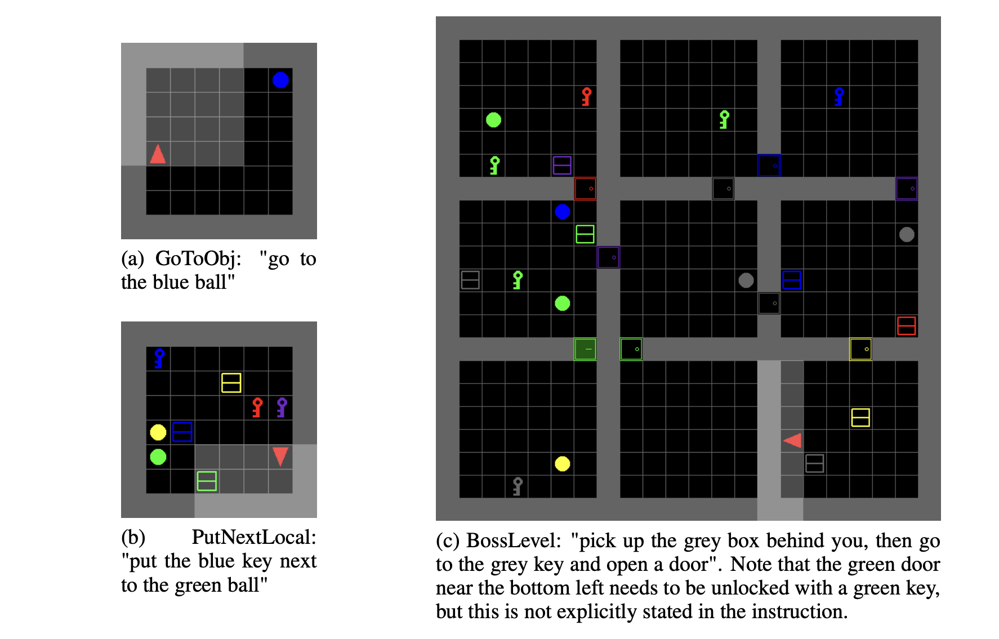

*Examples of three BabyAI levels. Source: Figure 1 from Chevalier-Boisvert et al., ["BabyAI: A Platform to Study the Sample Efficiency of Grounded Language Learning"](https://arxiv.org/abs/1810.08272), ICLR 2019.*

We use 84 training tasks and 28 held-out tasks, preserving the same 3:1 split within each BabyAI subtask family. The main configuration is:

| Setting | Value |
| --- | --- |
| Model | Qwen3.5-9B |
| Training length | 100 policy updates |
| Retained training batch | 128 rollouts |
| Rollouts per task group | 8 |
| Maximum interaction length | 20 turns |
| Sampling temperature | 0.7 |
| Thinking | Disabled |
| Held-out evaluation | 28 tasks × 3 rollout replicates per checkpoint |

With explicit thinking disabled, each decision was intended to map the partial observation and accumulated trajectory to a short action rather than an exposed chain-of-thought deliberation. Combined with the 20-turn cap, this made the experiment a test of action-oriented navigation under tight interaction and inference budgets. This setting is relevant to embodied and robotics-like agents, where response latency and action efficiency can matter alongside planning quality.

The turn cap acted as a coarse length penalty because a policy that required additional actions could not continue collecting progress. The reward comparison therefore reflected both task learning and the ability to make progress within a fixed interaction budget. This may favor policies that solve tasks in fewer turns, and RL could match or exceed ECHO if given a larger budget.


Despite this limitation, the constrained setting remains practically meaningful. Inference costs and fixed agent budgets make length efficiency important. ["True Agents Model the World"](https://www.primeintellect.ai/blog/true-agents-model-the-world) found that ECHO runs also tended to use fewer turns under a larger turn budget, suggesting that this behavior is not limited to tightly capped runs. However, our BabyAI results do not establish whether the reward advantage would persist if the 20-turn cap were relaxed.

## ECHO vs. RL

We first compared RL with ECHO weights 0.05, 0.5, and 1.0 to test whether observation prediction changed reward, training consistency, turn usage, and rollout efficiency, and whether those effects depended on its weight. We ran each of the four objectives three times independently. At every evaluation checkpoint, each run was evaluated on all 28 held-out tasks with three rollout replicates per task. The bold curves below average the three independent training runs, and the bands show plus or minus one sample standard deviation across those runs.

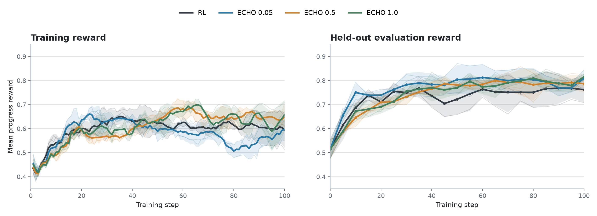

*Training reward uses a five-step moving mean. Bold lines are means across three independent training runs; faint lines show the individual runs; bands are plus or minus one sample standard deviation across runs.*

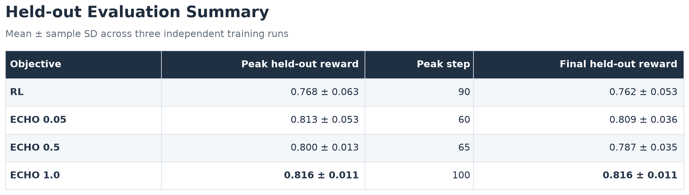

Across three independent training runs, all three ECHO variants finish above RL in mean held-out reward. ECHO 0.05 reaches its best mean earliest, at step 60. ECHO 1.0 improves more gradually, reaches the strongest final mean, and has the smallest across-run variation at step 100.

RL also has the largest run-to-run variation at the final checkpoint: its SD is 0.053, compared with 0.036 for ECHO 0.05, 0.035 for ECHO 0.5, and 0.011 for ECHO 1.0. Every tested ECHO weight achieves a higher peak and final mean reward than RL while also producing a more consistent final result across runs.

These findings are promising but scoped. We tested one model size in one embodied AI environment using 84 training tasks and 28 held-out tasks, with three independent training runs per objective. They provide evidence that ECHO handles this length-constrained embodied setting well and motivate replication across turn limits, environments, model families, and dataset sizes.

## Output behavior and token usage

Every policy was allowed up to 1,024 tokens per action even though BabyAI requires only one short action phrase. At higher ECHO weights, the trained policy sometimes continued the trajectory format inside its own response, generating imagined observations and additional actions instead of stopping after its first action.

An abridged held-out example from ECHO 1.0 is:

```text
go to blue locked door 1                         <- executed by the environment
Observation: There is a blue locked door ...    <- imagined by the model
Action: toggle and go through blue locked door 1
Observation: There is a yellow closed door ...
Action:
```

The BabyAI harness parses and executes only the first line. The first action can therefore still earn reward even when the remainder of the completion is malformed. The complete assistant response nevertheless remains in the saved trajectory and subsequent model context, increasing both generated tokens and the prompt length of later turns.

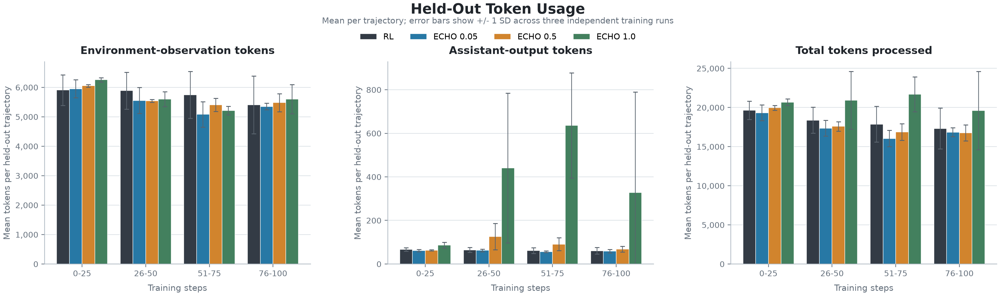

*Bars show mean tokens per held-out trajectory, and error bars show plus or minus one sample standard deviation across three independent training runs. Each step window pools evaluations from every five-step checkpoint over 28 held-out tasks with three rollout replicates. Environment observations are counted each time they are processed, so earlier observations can be counted again on later turns. Total tokens also include the system message, initial prompt, prior-action history, and chat-template overhead.*

Environment-observation processing remains broadly similar across objectives. The large assistant-output counts at higher ECHO weights are driven by a minority of transcript-like completions rather than uniformly longer action strings. They should not be interpreted as evidence that the model learned an accurate simulator.

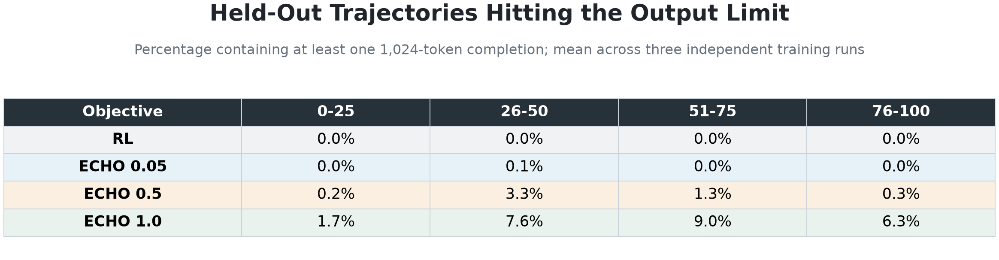

*Percentage of held-out trajectories containing at least one 1,024-token assistant completion. Each five-step checkpoint evaluates 28 held-out tasks with three rollout replicates; values are pooled into 25-step windows and then averaged across three independent training runs.*

This behavior could be constrained at inference by stopping generation at the first newline, enforcing a one-action output grammar, or using a substantially smaller completion limit. The present experiments preserve the same 1,024-token limit for RL and ECHO, which exposes that ECHO can induce trajectory continuation or role confusion without necessarily destroying the useful policy encoded in the first action.

## Switching objectives after 50 steps

After comparing fixed objectives, we asked whether RL and ECHO could hand off to one another during training. Each schedule ran for 100 updates and switched at the midpoint. We write `RL (50) → ECHO (50)` for 50 RL updates followed by 50 ECHO updates, and `ECHO (50) → RL (50)` for the reverse. Parenthesized numbers denote update counts, while the ECHO weight is stated separately. Standard ECHO still includes the RL policy objective; switching to ECHO adds the observation-prediction loss, while switching back to RL removes it.

We tested both directions at ECHO weights 0.05, 0.5, and 1.0. Each schedule has one training run. Every evaluation checkpoint covers all 28 held-out tasks with three rollout replicates, so the evaluation bands show variation across rollout replicates rather than across independent training runs. The faint reference curves show the three-run means of the corresponding non-switched RL and ECHO objectives.

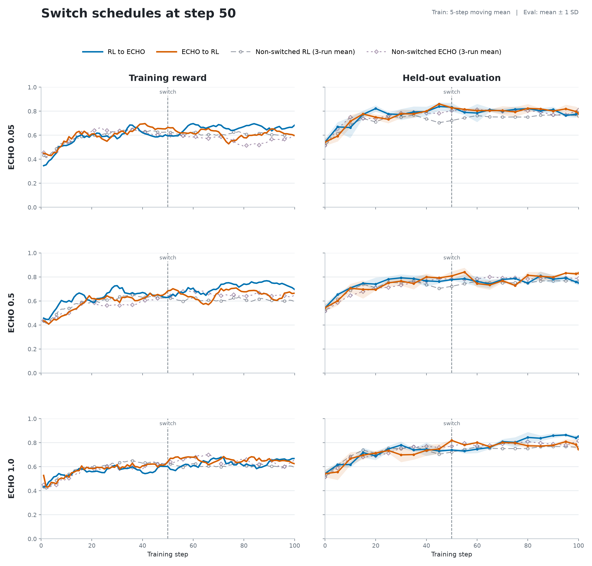

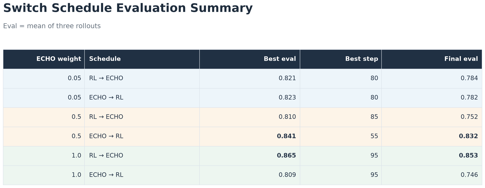

The ordering effect depended on the ECHO weight. At 0.05, the two directions were effectively tied: their best post-switch evaluations were `0.821` and `0.823`, and they finished at `0.784` and `0.782`. At 0.5, `ECHO (50) → RL (50)` was stronger, finishing at `0.832` compared with `0.752` for `RL (50) → ECHO (50)`. At 1.0, the result reversed: `RL (50) → ECHO (50)` reached `0.865` at step 95 and finished at `0.853`, while `ECHO (50) → RL (50)` peaked at `0.809` after the switch and finished at `0.746`.

These runs show that switching between RL and ECHO is feasible, but they do not establish a generally better ordering or switch point. Each schedule has only one training run, and the best direction changed with the ECHO weight. The result may also vary across benchmarks.

## Extending the schedules to 200 steps

The 100-step experiments showed that the objectives could hand off without a universal collapse. We next used ECHO 1.0, the strongest final configuration in the primary comparison, to test whether the behavior persisted over 200 updates. Each schedule below has one training run, and every evaluation checkpoint again covers the 28 held-out tasks with three rollout replicates per task. The faint non-switched RL and ECHO 1.0 curves are from separate, independent runs and are shown only for comparison.

### Non-switched runs

We first extended RL and ECHO 1.0 without changing objectives, giving each 200 updates. This tests whether the difference observed at 100 steps persists, disappears, or emerges differently with additional optimization.

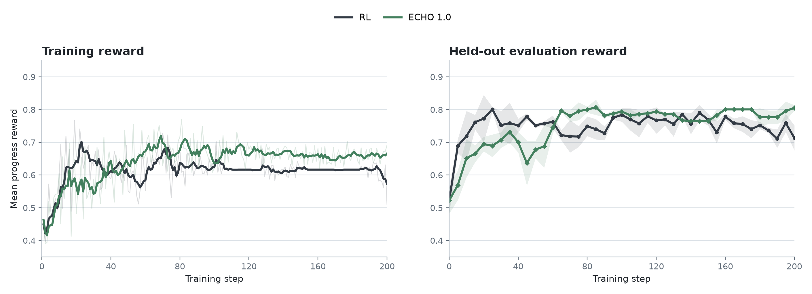

The non-switched runs reach similar peak held-out rewards, but on different timelines. RL reaches `0.801` at step 25, then loses much of that gain and finishes at `0.713`. ECHO 1.0 peaks later, reaching `0.807` at step 85, and holds that performance through the end of training with a final reward of `0.805`.

The 100-step experiments showed that higher ECHO weights could induce transcript-like continuations in the model’s output. In the separate 200-step ECHO 1.0 run, this behavior appeared temporary: the fraction of held-out trajectories that exhausted the output-token limit peaked at 50% at step 45, largely disappeared by step 85, and remained at zero after step 150. During steps 176–200, ECHO averaged 9.6 turns and 16,155 processed tokens per trajectory, compared with 11.7 turns and 19,948 tokens for RL. This single-run evidence suggests that the policy recovered from the output drift rather than remaining trapped in it.

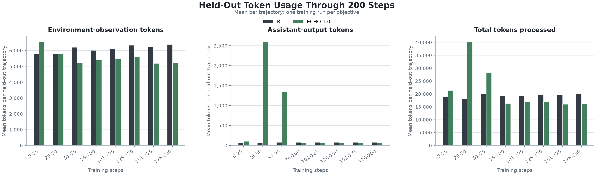

*Bars show mean tokens per held-out trajectory from one training run per objective. Each step window pools five-step checkpoints, and each checkpoint evaluates 28 held-out tasks with three rollout replicates. Environment observations are counted again whenever they are processed on later turns. Total tokens also include the system message, initial prompt, prior-action history, and chat-template overhead.*

### Equal-length phases

We then repeated the midpoint switch over a longer horizon. `RL (100) → ECHO (100)` means 100 RL updates followed by 100 ECHO 1.0 updates; `ECHO (100) → RL (100)` reverses that order. This keeps the two phases equal in length while moving the switch from step 50 to step 100.

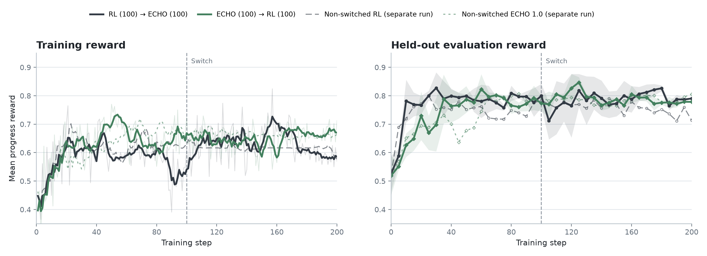

Both schedules remained viable after changing objectives. `RL (100) → ECHO (100)` peaked at `0.827` at step 30, before the switch, and finished at `0.790`. `ECHO (100) → RL (100)` peaked at `0.847` at step 125, after the switch, and finished at `0.779`.

### Short warmups

Finally, we tested asymmetric schedules. `RL (50) → ECHO (150)` asks whether a short RL warmup can establish basic action behavior before a longer ECHO phase jointly improves the policy and observation model. `ECHO (50) → RL (150)` asks whether a short ECHO warmup can establish useful environment representations before a longer RL phase refines the policy.

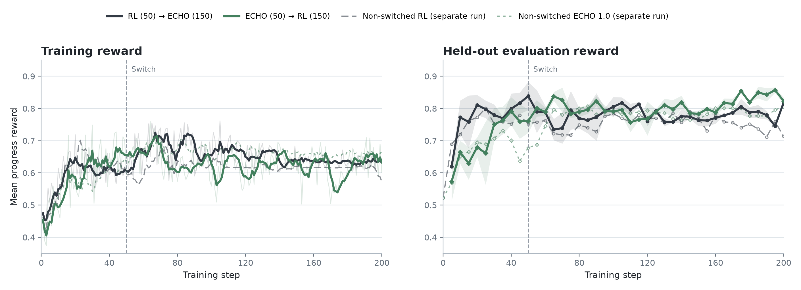

The two schedules finished close together. `ECHO (50) → RL (150)` peaked at `0.857` at step 195 and finished at `0.823`, while `RL (50) → ECHO (150)` peaked at `0.839` at step 50 and finished at `0.818`.


## Observation-only SFT

Standard ECHO retains the RL policy objective while adding observation-token prediction. To isolate the contribution of observation prediction, we also tested SFT-only phases in which the RL policy objective was disabled, leaving only supervised next-token prediction over environment observations. This ablation asks whether observation prediction can maintain or improve task behavior on its own, or whether ECHO's effect depends on combining it with reward-weighted policy updates. These are single training runs, and each evaluation checkpoint reports the mean and standard deviation across three rollout replicates over 28 held-out tasks. For context, the figures include faint non-switched RL and ECHO 1.0 references from separate runs.

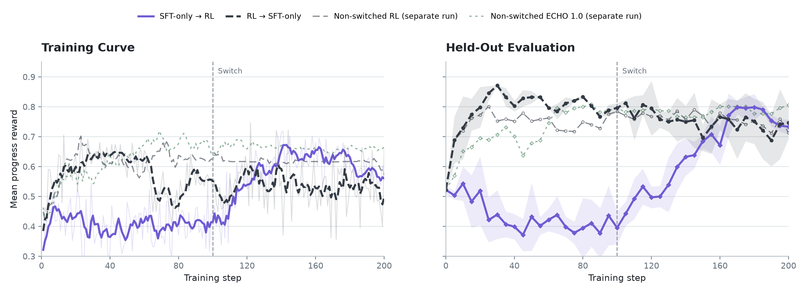


The direction of the effect is clear in both schedules. Under SFT-only training, held-out reward falls during the first 100 steps; switching to RL then recovers it. `SFT-only → RL` falls from `0.522` at initialization to `0.395` at the switch, then reaches a post-switch peak of `0.798` and finishes at `0.733`. In the reverse direction, RL first raises held-out reward to `0.796` at the switch, while the subsequent SFT-only phase gradually gives back part of that gain and finishes at `0.746`. Observation prediction alone therefore does not replace RL in this setting, although the model remains recoverable when RL is restored.

We also alternated the objectives every 50 steps:

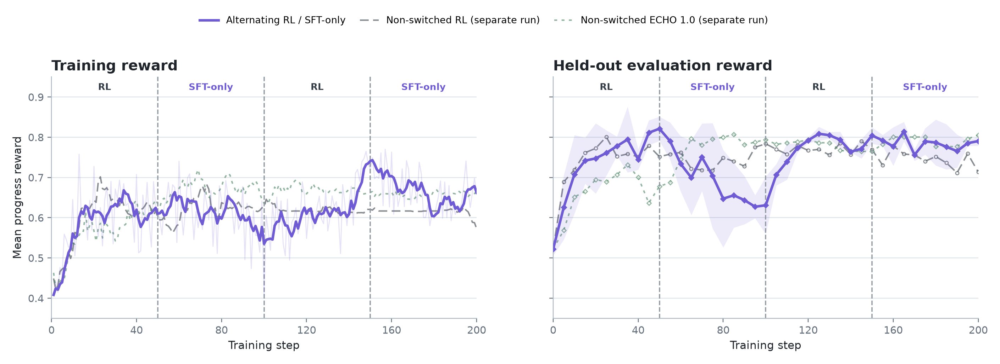


The first SFT-only phase reduces held-out reward from `0.821` at step 50 to `0.631` at step 100. RL then recovers it to `0.804` at step 150, and the final SFT-only phase finishes at `0.790`.

## Turn constraint and rollout efficiency

Three pre-batch filters were active: zero advantage, repetition, and gibberish. The logs record only aggregate generated and retained counts, so we cannot attribute rejected rollouts to individual filters. Qualitative inspection found no obvious repetition or gibberish in the saved trajectories, making zero advantage the likely dominant source of filtering. 

The turn metrics below describe trainable rollouts: the trajectories that were ultimately used for policy updates.

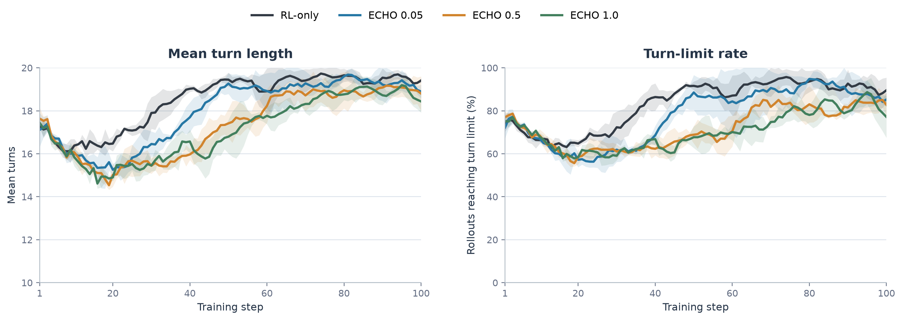

*Lines show five-step moving means over retained trainable rollouts. Bands are plus or minus one sample standard deviation across three independent runs.*

RL-only trajectories average 18.56 turns, and 83.4% reach the 20-turn limit. Both measurements fall as ECHO weight increases. At ECHO 1.0, trajectories average 17.17 turns and reach the limit 70.7% of the time. All objectives produce longer trajectories later in training, but ECHO delays the shift toward the turn limit.

The cap is binding much more often for RL, so the reward curves partly measure whether a policy can complete or advance a task within 20 actions. They do not tell us how the same policies would rank if RL were allowed to continue acting. RL may be equally strong or stronger at a larger turn budget.

Viewed another way, the hard cap is a form of length penalty: it assigns no value to progress that would occur after turn 20. It is a coarse penalty, but coping with it is useful in real world agents. The defensible conclusion from these runs is therefore that ECHO copes better with this particular length constraint, not that ECHO unconditionally dominates RL on BabyAI.

Prime-RL generates candidate rollouts until enough trainable samples remain for an update. The next plot shows the percentage of generated candidates that were retained and used for training.

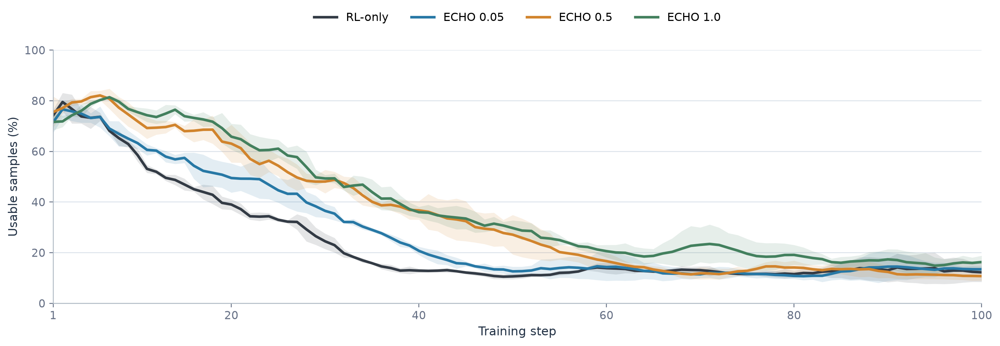

*Lines show the five-step moving mean of retained trainable rollouts divided by generated candidates. Bands are plus or minus one sample standard deviation across three independent runs.*

The usable-sample rate increases monotonically with ECHO weight. Across all 100 steps, it rises from 15.4% ± 1.3% for RL-only to 25.9% ± 2.2% for ECHO 1.0. Correspondingly, the number of extra candidates generated per update falls from 708.9 ± 73.6 to 368.9 ± 43.8. 

## What we learned

These findings apply to a deliberately constrained BabyAI setting with a 20-turn interaction limit and explicit thinking disabled, emphasizing fast, action-oriented navigation.

1. **ECHO improved mean held-out reward in this setting.** All tested weights finished above RL across three independent runs, with ECHO 1.0 producing the strongest final result.
2. **ECHO coped better with the hard length constraint.** Higher ECHO weights consistently reduced turn usage, reached the turn limit less often, increased the retained rollout fraction, and reduced the number of generated candidates required per update.
3. **RL and ECHO could hand off without an obvious persistent collapse.** The single-run schedules remained viable after switching at step 50 or 100, but they did not establish a generally better ordering or switch point.
4. **Observation prediction alone was not sufficient.** In the observation-only SFT ablation, held-out reward declined when reward-weighted policy updates were disabled and recovered when RL resumed. The positive ECHO results therefore appeared to depend on combining observation prediction with the RL policy objective.


## Reproducibility artifacts

The BabyAI environment can be found on Prime's Environment Hub.

## Acknowledgments

This work was completed during the Prime-RL residency. Sebastian Müller ([@omouamoua](https://x.com/omouamoua?lang=en)) advised the project, contributed greatly to the design and framing of the study, and helped with the writing. Billy Hoy initiated the project and led the experimentation, writing, and analysis.

## Citation

```bibtex
@article{hoy2026echo,
  title   = "ECHO on BabyAI",
  author  = "Hoy, Billy and Müller, Sebastian",
  year    = "2026",
  month   = "September",
  url     = "https://bhoy1.github.io/echo-babyai-findings/"
}
```
